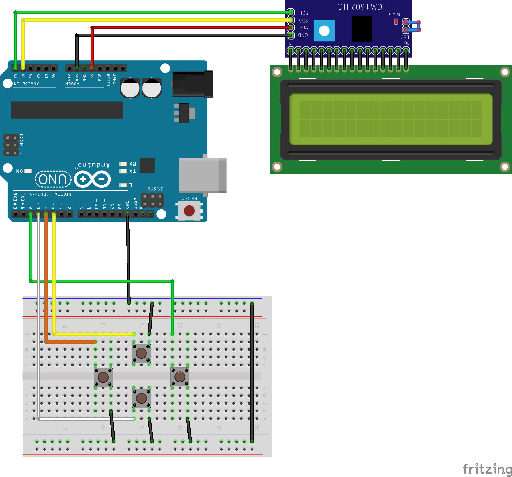
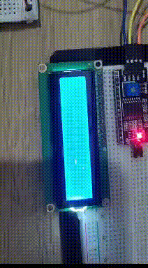

# Jogo da Cobrinha em Arduino

## Componentes utilizados:

* Display LCD 16x2
* Interface i2c para o display (não obrigatório)
* 4 Botoes
* protoboards
* jumpers

***
## Esquema de montagem:

**Monte os botões no formato de cruz com o intuito de imitar um d-pad**

***
## Pinos de conexão

### **Botões**

Todos os botões estão ligados no esquema de Internal Pullup
* Pino 2 -> direita
* Pino 3 -> baixo
* Pino 4 -> esquerda
* Pino 5 -> cima
* Conecte o outro pino dos botões ao GND

### **I2C**
* Pino A5/SCL -> I2C SCL
* Pino A4/SDA -> I2C SDA
* GND -> I2C GND
* 5V -> I2C VCC

***
## Está pronto!

